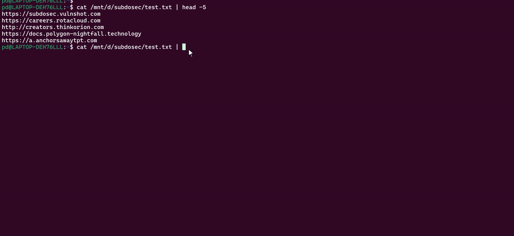
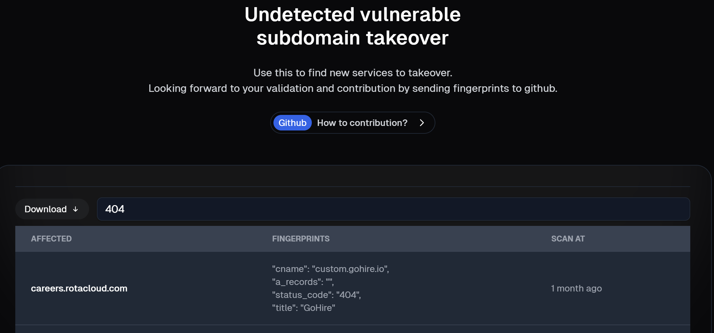

<p align="center">
<b>Subdosec</b>
</p>

<p align="center">
  <a href="#installation">Install</a> •
  <a href="#running-subdosec">Usage</a> •
  <a href="#web-based">Web Based</a> •
  <a href="#online-scan">Online scan</a> •
  <a href="#contribution">Contribution</a> •
  <a href="https://t.me/subdosec">Join Telegram</a>
</p>

---

Subdosec is not just a fast and accurate subdomain takeover scanner with no false positives. It also provides a complete database containing a list of sites vulnerable to subdomain takeover (public results), as well as detailed non-vuln subdomain metadata information such as IP, CNAME, TITLE, and STATUS CODE, which you can use for reconnaissance to find sites that may be vulnerable to subdomain takeover on new services.



---

# Installation

Requiretment :
To install, ensure that Node.js is already installed on your machine.
```
node -v
v18.+++
```

And then simply run the following command:
```
python3 -m pip install git+https://github.com/xcapri/subdosec.git --break-system-packages
or this if you want upgrade :
python3 -m pip install --upgrade git+https://github.com/xcapri/subdosec.git --break-system-packages
```


Then run this every time you start a new terminal session (until “server started successfully”).

```
$ subdosec -ins
 ____        _         _
/ ___| _   _| |__   __| | ___  ___  ___  ___
\___ \| | | | '_ \ / _` |/ _ \/ __|/ _ \/ __|
 ___) | |_| | |_) | (_| | (_) \__ \  __/ (__
|____/ \__,_|_.__/ \__,_|\___/|___/\___|\___|


Starting Node.js server...
Node.js server started successfully.
```

---
# Running subdosec

<b>[WARNING]
_Do not takeover all subdomains in test.txt,_
let everyone use that for demos.
</b>

<b>[INFO]
_Also check the [Release](https://github.com/xcapri/subdosec/releases) section._
You can find interesting info.
</b>

```
$ subdosec -h
 ____        _         _
/ ___| _   _| |__   __| | ___  ___  ___  ___
\___ \| | | | '_ \ / _` |/ _ \/ __|/ _ \/ __|
 ___) | |_| | |_) | (_| | (_) \__ \  __/ (__
|____/ \__,_|_.__/ \__,_|\___/|___/\___|\___|


usage: main.py [-h] [-mode {private,public}] [-initkey INITKEY] [-vo] [-pe] [-ins] [-lf LF] [-sfid]

Web scanner.

options:
  -h, --help            show this help message and exit
  -mode {private,public}
                        Mode of operation (private/public)
  -initkey INITKEY      Initialize the API key
  -vo                   VULN Only: Hide UNDETECT messages
  -pe                   Print Error: When there are problems detecting your target
  -ins                  Prepar node & start server
  -lf LF                Fingerprint lock: to focus on one or multiple fingerprints. (-lf github.io,surge.sh) and leave this arg to scan all fingerprints
  -pf                   Private Fingerprint: uses your local fingerprint. Example: -pf /path/to/tko.json
  -sfid                 To view all available fingerprint ids
  -o                    Save result locally to the specified path. Example: -o /path/to/dir
  -su                   Skip undetect will not stored to server (https://subdosec.vulnshot.com/result/undetected)
  -lu                   Undetec stored localy to the specified path. Example: -lu /path/to/dir
  -ks                   To shut down the server node if you want to not use subdosec for a long time

```

## Recomend command (no signup required & not saved to server )

- **Prepare list** (Support without protocol)
```
└─$ cat list 
https://careers.rotacloud.com
http://creators.thinkorion.com
https://docs.polygon-nightfall.technology
a.anchorsawaytpt.com
help.oceges.com
```

- **Command#1** (Skip stored undetect to server & save localy)
```
└─$ cat list | subdosec -su -o savevuln

https://careers.rotacloud.com [100.00%] [gohire.io] [VULN] [SAVED]
http://creators.thinkorion.com [100.00%] [UNDETECT]
https://a.anchorsawaytpt.com [100.00%] [UNDETECT]
https://help.oceges.com [100.00%] [UNDETECT]
```
OR using root domain 
```
cat list
example.com 

cat list | subfinder -silent | subdosec -su -o savevuln 
```

```
└─$ ls savevuln/
gohire.io_tko.txt

└─$ cat savevuln/*
careers.rotacloud.com
```
- **Command#2** (Forward result to notify)
```
└─$ cat list | subdosec -o savevuln -su -vo | notify -silent 

https://careers.rotacloud.com [100.00%] [gohire.io] [VULN] [SAVED]

```

- **Command#3** (Stored undetec to local if you need for reconaise)
```
└─$ cat list | subdosec -o savevuln -lu saveundetect

https://careers.rotacloud.com [100.00%] [gohire.io] [VULN] [SAVED]
http://creators.thinkorion.com [100.00%] [UNDETECT]
https://a.anchorsawaytpt.com [100.00%] [UNDETECT]
```

```
└─$ ls saveundetect/
undetect.json

└─$ cat saveundetect/undetect.json
[
    {
        "title": "creators.thinkorion.com Reviews on Testimonial.to",
        "status_code": 301,
        "redirect_url": "https://creators.thinkorion.com/",
        "cname_records": [
            "cname.testimonial.to"
        ],
        "a_records": [
            "216.24.57.4",
            "216.24.57.252"
        ],
        "subdomain": "creators.thinkorion.com",
        "rootdomain": "thinkorion.com"
    },
    {
        "title": "Subscribe to Get the New Feed Me, Lovely Cookbook",
        "status_code": 200,
        "redirect_url": "No redirects",
        "cname_records": null,
        "a_records": [
            "3.13.222.255",
            "3.130.60.26",
            "3.13.246.91"
        ],
        "subdomain": "a.anchorsawaytpt.com",
        "rootdomain": "anchorsawaytpt.com"
    }
]
```
------
Every subdomain takeover scan will default to the public dashboard https://subdosec.vulnshot.com/scan#vulnlist, so the following commands can be used:
## Default scan 
- ``cat list_subdomain | subdosec``, This command will display the UNDETECT & VULN scan output with the output publicly saved to the subdosec web as a database of vulnerable sites.
- ``cat list_root_domain | subfinder -silent | httpx -silent | subdosec``, you can also scan subdomains from the subfinder results directly.
- ``cat list_root_domain | subfinder -silent | httpx -silent | subdosec -vo | notify``, You can also add other commands to throw the output to telegram, slack, dc with notify.
## Private scan 
You need to create an account here: https://subdosec.vulnshot.com/signup. Simply use your email, and you will be given a Subdosec env file containing your password and API key. Use the API key to initialize the tool with the command:

``subdosec -initkey your-random-key``.

You can then use the password to login and view the scan results on the website (this is optional; the CLI output is sufficient). However, the scan results will still be available on the website in private mode, accessible only to logged-in users.
Final command:

```cat list_root_domain | subfinder -silent | httpx -silent | subdosec -mode private```

---
# Web Based

Knowing the function of the subdosec web, here you can use the https://subdosec.vulnshot.com/result/undetected feature as a reconnaissance, to find out IP, CNAME, TITLE, STATUS CODE, etc. as further information or even to find new takeover subdomains.

For example, you search for a site that is not detected as vulnerable by subdosec with the keyword *404*, and there is information on cname.gohire.io and the title GoHire, which if you search on Google, there is no article information about subdomain takeover on the gohire service.



After that you analyze it turns out that the service is vulnerable to subdomain takeover. then you can send the fingerprint information to us via telgram channel [Subdosec Group](https://t.me/subdosec).

Or via [New Discussion](https://github.com/xcapri/subdosec/discussions/new?category=ideas)

Dynamically you can use this element for rules ``title, cname, status_code, in_body, a_record, redirect``:

```
{
  "name": "Subdomain takeover - GoHire",
  "rules": {
    "cname": "custom.gohire.io",
    "in_body": "Page not found",
    "status_code": "404"
  },
  "status_fingerprint": 0,
  "reference": "https://help.gohire.io/en/articles/3385288-setting-up-a-custom-domain",
  "service": "gohire.io",
  "logo_service": "https://gohire-website.s3.amazonaws.com/img/logos/gh-logo-main.gif"
}
```

---

## Online scan

If you are not a person with a security background, maybe a web-dev/programmer and not familiar with cli tools. you can use the web version to scan all your subdomains with a max of 10 subdomains per scan.


# Contribution
We greatly appreciate any contributions you make. If you have suggestions, feedback, or wish to contribute further, please feel free to join our Telegram group and reach out to us there.


# Best regards
[Xcapri](https://github.com/xcapri),
[Tegalsec](https://github.com/tegal1337)